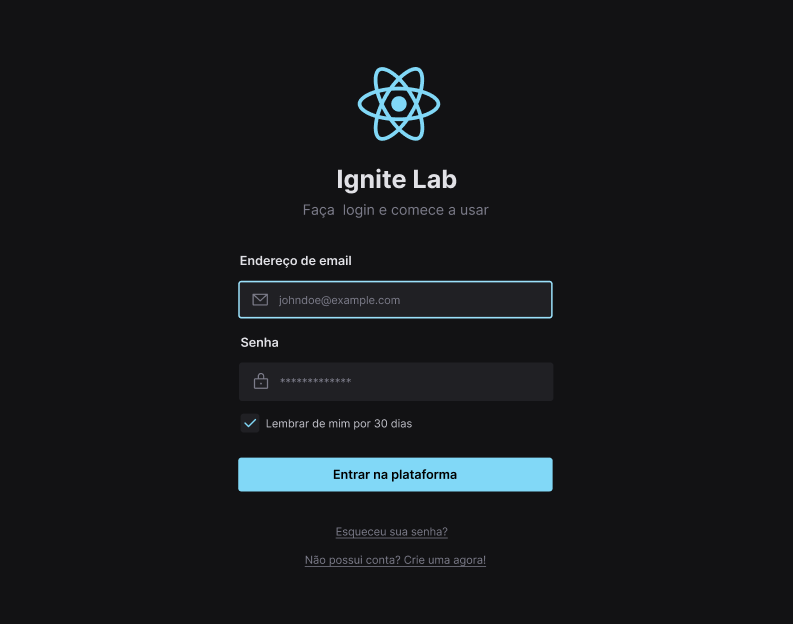

# Design System

Project created at Rocketseat's Ignite Lab event, where we built a complete Design System using technologies and tools such:

- Figma
- React with Vite
- Typescript
- Tailwind
- Radix Ui
- Storybook
- CD/CI with GitHub actions
- Jest and Testing Library

## Figma Layout

[Figma Design Link](https://www.figma.com/file/BOrjXNeKffGrYeezeRaKj7/Ignite-Lab-Design-System?node-id=0%3A1)

## Storybook Components

[Storybook Link](https://mandyHellz.github.io/design-system-ignite-lab/)

Or you can click on Github Pages link to see the Storybook components:

